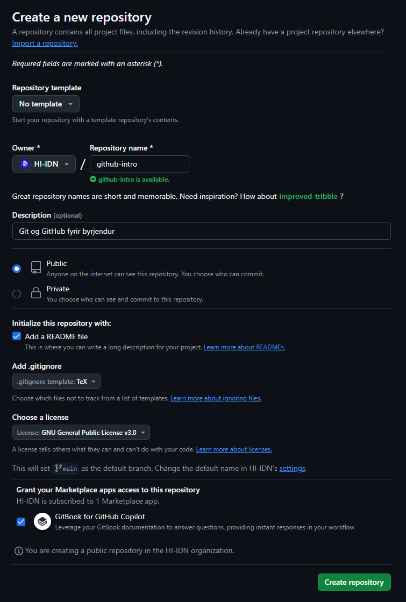
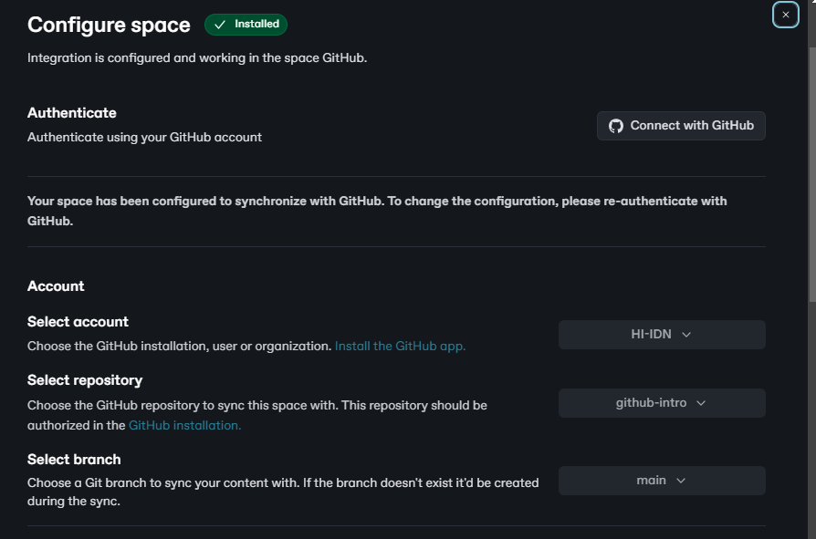

# Hvernig nota GitBook?

[GitBook](https://www.gitbook.com/) er öflugt skjölunartól sem gerir kleift að skrifa og birta
kennsluefni eða tækniskjöl á vefnum. Það byggir á Markdown og er hægt að tengja beint við GitHub
fyrir útgáfustýringu.

## Af hverju að nota GitBook?

- ✅ **Auðvelt að viðhalda og uppfæra efni** með Markdown
- ✅ **Tengist beint við GitHub** – allar breytingar eru skráðar
- ✅ **Styður samvinnu** – margir geta unnið samtímis
- ✅ **Snyrtileg framsetning** – efni birtist sem vefsíða með leiðarkerfi (leitin er sjálfgefinn
  feature)

## Hvernig virkar GitBook?

### 1️⃣ Búa til GitBook verkefni

- Hægt er að setja upp nýtt GitBook beint á [GitBook.com](https://www.gitbook.com/).
- Einnig er hægt að nota GitHub repo og tengja það við GitBook.

#### 🔹 Búa til nýtt GitHub repo fyrir GitBook

- Farðu á [GitHub](https://github.com/) og búðu til nýja geymslu.
- Veldu **Public** eða **Private**, allt eftir því hvort efnið á að vera aðgengilegt öllum eða
  aðeins lokuðum hópi.
- Gott er að bæta við **.gitignore** skrá fyrir viðeigandi skráargerð (t.d. TeX, Markdown).
- Undir **Grant your Marketplace apps access to this repository**, veldu **GitBook for GitHub
  Copilot** til að tryggja sjálfvirka samstillingu við GitBook í framtíðinni.

  

### 2️⃣ Tengja GitBook við GitHub repo

- Opnaðu [GitBook](https://www.gitbook.com/) og farðu í **Configure space**.
- Tengdu þinn GitHub aðgang með **Authenticate**.
- Veldu viðeigandi **organization/user** fyrir geymsluna.
- Veldu **repository** sem GitBook á að samstilla við.
- Veldu **branch** (t.d. `main`). Ef branch-ið er ekki til, verður það búið til sjálfkrafa.
- Gakktu úr skugga um að rétt vinnumappa **project directory** sé valin (sjálfgefið `./`). Þar
  sem GitBook birtir `README` skrána í rót heimasíðunnar, þá er ágætt að hafa GitBook skrárnar í
  sér undirmöppu (t.d. `./docs`), þá er hægt að hafa aðra `README` skrá í rótinni um hvernig
  hægt er að leggja til við verkefnið (t.d. `CONTRIBUTING.md`).
- Veldu hvort þú viljir að *fyrsta* samstillingin sé sjálfvirkt gerð út frá GitHub eða GitBook.

  

### 3️⃣ Skrifa og skipuleggja efni í GitBook

- Skrá **`SUMMARY.md`** stýrir uppsetningu efnis.
- Hægt er að bæta við myndum, töflum og kóðadæmum fyrir betri framsetningu.
- Allar breytingar eru samstilltar við GitHub þegar þær eru vistaðar.

## Dæmi um GitBook verkefni

### 📖 GitHub fyrir byrjendur

➡️ [GitHub Intro](https://github.com/HI-IDN/github-intro) (þessar glósur) 
og undirliggjandi [kóði](https://github.com/HI-IDN/github-intro)

- Skjölun fyrir grunnatriði Git og GitHub.
- Fjallar um branches, pull requests, commit skilaboð og fleiri vinnubrögð.

### 📖 Upplýsingaverkfræði

➡️ [IDN302G-GitBook](https://github.com/HI-IDN/IDN302G-GitBook)
og undirliggjandi [kóði](https://github.com/HI-IDN/IDN320M-GitBook/)

- Kennsluefni um upplýsingaverkfræði.
- Inniheldur dæmi og útskýringar um SQL forritun.

### 📖 Hermun

➡️ [IDN403M-GitBook](https://github.com/HI-IDN/IDN403M-GitBook) og undirliggjandi [kóði](https://github.com/HI-IDN/IDN403M-GitBook/)

- Glósur og efni fyrir námskeið um hermun.
- Fjallar um hermilíkön, stakræna atburðahermun og greiningu niðurstaðna.

## 🔧 Hagnýt ráð

- **Notaðu `SUMMARY.md`** til að skipuleggja efni (efnisyfirlit).
- **Virkjaðu GitHub sync** svo allar breytingar í repo uppfærist sjálfkrafa í GitBook.
- **Notaðu Markdown fyrir snyrtilega framsetningu** – til dæmis `**feitletrað**`, `*skáletrað*`, og
  töflur.
- **Bættu við myndum og kóðablokkum** til að skýra útskýringar betur.

Með þessum aðferðum geturðu auðveldlega sett upp og viðhaldið vönduðu kennsluefni með GitBook! 🚀
