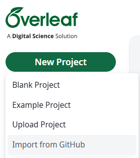
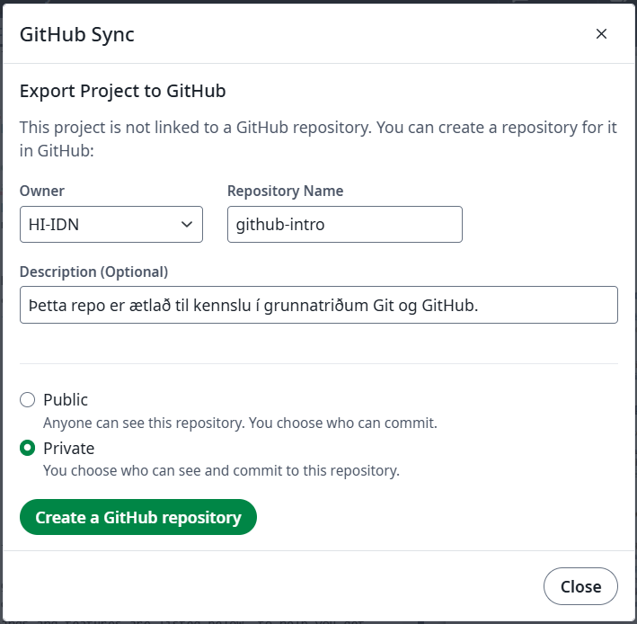
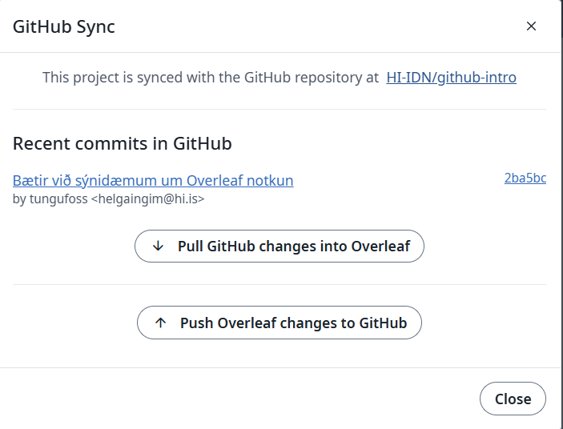

# Hvernig nota GitHub með Overleaf?

[Overleaf](https://www.overleaf.com/) er vinsælt LaTeX-ritunarumhverfi sem gerir samvinnu auðvelda.
Með því að tengja Overleaf við GitHub geturðu fylgst með breytingum á skjölum og samstillt þau
auðveldlega milli kerfa.

## Af hverju að tengja Overleaf við GitHub?

- ✅ **Geymir útgáfusögu skjala í GitHub**
- ✅ **Auðveldar samvinnu með pull requests og breytingaspori**
- ✅ **Öryggi – auðvelt að taka afrit og endurheimta eldri útgáfur**
- ✅ **Hægt að vinna með LaTeX í Overleaf og í staðbundnum ritli**

## Hvernig tengja Overleaf við GitHub?

### 1️⃣ Búa til nýtt repo á GitHub (valfrjálst)

- Ef geymslan er ekki þegar til geturðu búið hana til á [GitHub](https://github.com/).
- Hins vegar er líka hægt að búa hana til beint í Overleaf (sjá næsta skref).

### 2️⃣ Tengja Overleaf við GitHub

> Þú þarft að veita Overleaf aðgang að GitHub reikningnum þínum, ef þú hefur ekki gert það áður.

#### 📌 Fjargeymsla nú þegar til:

- Opnaðu [Overleaf](https://www.overleaf.com/) og veldu `New Project` og því næst sækirðu
  verkefnið frá GitHub með því að velja `Import from GitHub`.
- Veldu úr listanum yfir geymslur (repositories) sem þú vilt tengja við Overleaf.

  

#### 📌 Fjargeymsla ekki til (búa til repo í Overleaf):

- Opnaðu verkefnið þitt á [Overleaf](https://www.overleaf.com/).
- Farðu í `Menu` (í efra vinstra horni).
- Veldu `GitHub` undir `Sync`.
- Veldu eiganda (owner, getur verið þú eða organisation) fyrir geymslu.
- Veldu nafn á geymsluna (repository) sem á að tengja við Overleaf. Þetta nafn þarf að vera
  einkvæmt á GitHub (annars færðu villu).
- Veldu hvort geymslan á að vera `Public` eða `Private`. Hægt er að breyta þessu í
  GitHub stillingum síðar.
- Veldu `Create a GitHub Repository`.

  

### 3️⃣ Sync-a skjölin

- **Frá Overleaf til GitHub**: Ýttu á `Push Changes` til að senda breytingar yfir á GitHub.
- **Frá GitHub til Overleaf**: Ýttu á `Pull Changes` til að fá nýjustu breytingarnar.

  

## 🔧 Hagnýt ráð

- **Forðastu merge conflicts** með því að **pull-a áður en þú push-ar**.
- **Ef einhver annar hefur breytt skjalinu í Overleaf**, gætirðu þurft að sameina breytingarnar í
  staðbundnum ritli áður en þú push-ar.
- **Ekki setja afleiddar skrár í GitHub**, t.d. `*.aux`, `*.log`, `*.synctex.gz`, eða `*.pdf` –
  bættu þeim í `.gitignore`.
- **Gott er að bæta við README skrá** í GitHub sem útskýrir:
    - Hvaða `.tex` skrá er aðalskjalið.
    - Hvaða LaTeX compiler er notaður (`pdflatex`, `xelatex`, `lualatex`).

Með þessum aðferðum geturðu auðveldlega unnið með LaTeX skjöl í bæði Overleaf og GitHub! 🚀